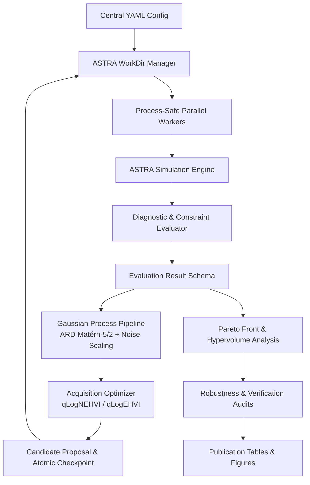

# Repository Review: `mobo-linac`

- **Project**: Multi-Objective Bayesian Optimization for a 200 MeV Electron Injector Linac
- **Author**: Chong Shik Park (*Department of Accelerator Science and Center for Accelerator Research, Korea University*)
- **Version**: `1.0.0` | **Status**: Production & Publication Ready

---

## 1. Executive Summary

`mobo-linac` is a scientific machine learning and beam dynamics optimization framework designed for the multi-objective parameter optimization of a 200 MeV S-band photoinjector linac. The framework couples high-fidelity macroparticle tracking simulations ([`ASTRA`](../bin/astra)) with modern Bayesian Optimization surrogates ([`BoTorch`](../pyproject.toml#L17) / [`GPyTorch`](../pyproject.toml#L18) / [`PyTorch`](../pyproject.toml#L16)).

The repository has evolved through three completed phases (**Scalarized BO** $\to$ **Unconstrained MOBO** $\to$ **Constraint-Aware MOBO** with Robustness Analysis & Pareto Verification), culminating in a fully verified, publication-grade codebase backed by **174 automated tests**, **92 completed task plans**, and end-to-end manuscript and artifact generation pipelines.



---

## 2. Architecture & Modular Package Layout

The core package [`mobo_linac`](../src/mobo_linac) is cleanly structured with strict separation between beam dynamics simulation, surrogate modeling, acquisition optimization, and evaluation orchestration:

| Subpackage / Module | Role & Core Components | Key Symbols & Reference Files |
| :--- | :--- | :--- |
| **`config`** | Centralized dataclass configurations and validation | [`MoboConfig`](../src/mobo_linac/config.py#L187-L257), [`DesignVariableConfig`](../src/mobo_linac/config.py#L17-L48), [`ObjectiveConfig`](../src/mobo_linac/config.py#L50-L68), [`ConstraintsConfig`](../src/mobo_linac/config.py#L70-L101), [`load_config`](../src/mobo_linac/config.py#L259-L299) |
| **`astra`** | ASTRA execution engine & isolated workdirs | [`AstraRunner`](../src/mobo_linac/astra/runner.py#L25-L120), [`AstraWorkDirManager`](../src/mobo_linac/astra/workdir.py#L20-L110), [`run_astra_eval`](../src/mobo_linac/astra/runner.py#L150-L240) |
| **`execution`** | ProcessPoolExecutor parallel worker management | [`BatchEvaluator`](../src/mobo_linac/execution/parallel.py#L25-L95), [`evaluate_candidates_parallel`](../src/mobo_linac/execution/parallel.py#L100-L160) |
| **`models`** | Gaussian Process surrogates & hyperparameter tuning | [`build_gp_models`](../src/mobo_linac/models/gp.py#L22-L144), [`SurrogatePipeline`](../src/mobo_linac/models/pipeline.py#L25-L160), [`optimize_gp_hyperparameters`](../src/mobo_linac/models/tuning.py#L30-L110) |
| **`acquisition`** | Multi-objective acquisition functions & proposal | [`build_acquisition_function`](../src/mobo_linac/acquisition/mobo.py#L30-L120), [`generate_next_candidates`](../src/mobo_linac/acquisition/mobo.py#L130-L240) |
| **`campaigns`** | Single-run and paired multi-seed benchmark runners | [`MoboCampaignRunner`](../src/mobo_linac/campaigns/runner.py#L30-L280), [`BenchmarkCampaignRunner`](../src/mobo_linac/campaigns/benchmark.py#L30-L180) |
| **`constraints`** | Multi-channel feasibility & Normal CDF models | [`ConstraintEvaluator`](../src/mobo_linac/constraints.py#L20-L120), [`compute_probability_of_feasibility`](../src/mobo_linac/constraints.py#L125-L180) |
| **`evaluation`** | Standardized result schema and failure classification | [`EvaluationResult`](../src/mobo_linac/evaluation.py#L20-L90), [`FailureCategory`](../src/mobo_linac/evaluation.py#L95-L120) |
| **`metrics`** | Hypervolume, non-dominated sorting, LaTeX exporter | [`HypervolumeTracker`](../src/mobo_linac/metrics/hypervolume.py#L20-L110), [`extract_pareto_front`](../src/mobo_linac/metrics/pareto.py#L25-L90), [`export_latex_table`](../src/mobo_linac/metrics/latex.py#L30-L120) |
| **`robustness`** | RF phase/field jitter & photocathode laser variations | [`RobustnessEvaluator`](../src/mobo_linac/robustness/evaluator.py#L30-L150), [`load_perturbation_spec`](../src/mobo_linac/robustness/evaluator.py#L155-L210) |
| **`verification`** | Fresh re-evaluation & SHA-256 candidate audits | [`ParetoVerifier`](../src/mobo_linac/verification/verifier.py#L25-L130), [`compute_file_sha256`](../src/mobo_linac/verification/verifier.py#L135-L160) |
| **`cli`** | Unified CLI entrypoint (`mobo-linac`) | [`main`](../src/mobo_linac/cli.py#L1-L350) |

---

## 3. Physics & Optimization Formulation

### 1. Six Design Variables
The parameter vector $\mathbf{x} \in \mathbb{R}^6$ maps dynamically to [`astra.in`](../astra.in):
1. **Solenoid Peak Field**: $B_z^{\text{max}} \in [0.175, 0.237]\text{ T}$
2. **Quadrupole 1 Gradient**: $G_1 \in [1.44, 4.33]\text{ T/m}$
3. **Quadrupole 2 Gradient**: $G_2 \in [-4.33, -1.44]\text{ T/m}$
4. **RF Gun Phase**: $\phi_{\text{gun}} \in [-30.0^\circ, 30.0^\circ]$
5. **Coupled ACC1/ACC2 Phase**: $\phi_{1,2} \in [-50.0^\circ, 50.0^\circ]$
6. **Coupled ACC3/ACC4 Phase**: $\phi_{3,4} \in [0.0^\circ, 360.0^\circ]$

### 2. Three Competing Objectives (Minimization)
$$\min_{\mathbf{x}} \mathbf{f}(\mathbf{x}) = \begin{bmatrix} \varepsilon_{n,x}(\mathbf{x}) & [\mu\text{m}\cdot\text{rad}] \\ \varepsilon_{n,y}(\mathbf{x}) & [\mu\text{m}\cdot\text{rad}] \\ \sigma_E(\mathbf{x}) & [\text{keV}] \end{bmatrix}$$
*BoTorch internal convention maps physical minimization to maximization via `model_sign = -1`.*

### 3. Seven Physical Diagnostic Constraints
A candidate is physically feasible if and only if all 7 diagnostics satisfy bounds:
- **Beam transverse size**: $\sigma_x \le 1.0\text{ mm}$, $\sigma_y \le 1.0\text{ mm}$
- **Beam divergence**: $\sigma_{x'} \le 1.0\text{ mrad}$, $\sigma_{y'} \le 1.0\text{ mrad}$
- **Longitudinal bunch length**: $\sigma_z \le 1.0\text{ mm}$
- **Mean kinetic energy**: $195.0\text{ MeV} \le \langle E_{\text{kin}} \rangle \le 205.0\text{ MeV}$
- **Core particle transmission**: $\mathcal{T} \ge 90\%$

### 4. Advanced Surrogate & Acquisition Features
- **Relative Fixed Noise Scaling**:
  $$\sigma_{\text{obs}}^2 = \max\left(\eta \cdot \text{Var}(Y_m),\, \sigma_{\text{floor}}^2\right)$$
  with $\eta = 10^{-6}$ for multi-scale variance balance ($\mu\text{m}\cdot\text{rad}$ vs $\text{MeV}$).
- **Log-Expected Hypervolume Improvement**: `qLogNEHVI` / `qLogEHVI` with analytical normal CDF feasibility weighting.
- **Fixed Publication Reference Point**: $\mathbf{r} = [1.5\,\mu\text{m}\cdot\text{rad},\; 1.5\,\mu\text{m}\cdot\text{rad},\; 1.5\,\text{MeV}]$ used consistently across all runs.

---

## 4. Key Strengths of the Repository

1. **High Code Quality & Fault Isolation**:
   - Every ASTRA simulation executes inside an isolated scratch directory managed by [`workdir.py`](../src/mobo_linac/astra/workdir.py), completely preventing race conditions during parallel evaluations.
   - Comprehensive error categorization via [`evaluation.py`](../src/mobo_linac/evaluation.py#L95-L120) flags premature exit-plane particle loss, core collimation loss, and timeouts.
2. **Crash-Proof State Persistence**:
   - Checkpoints are saved using POSIX atomic writes (`_atomic_torch_save`), ensuring interrupted runs can be resumed seamlessly via `mobo-linac run --resume-checkpoint`.
3. **Rigorous Benchmarking & Verification**:
   - Paired multi-seed benchmark campaigns evaluate MOBO against NSGA-II and Sobol baselines using identical initial designs.
   - Independent Pareto candidate verification protocol computes SHA-256 input checksums and verifies solutions using high-statistics fresh particle distributions.
4. **Complete Publication Tooling**:
   - Automated generation of LaTeX manuscript tables ([`latex.py`](../src/mobo_linac/metrics/latex.py)), publication figures ([`generate_paper_figures.py`](../scripts/generate_paper_figures.py)), and an interactive documentation portal in [`index.html`](index.html).
5. **GPU Acceleration & Memory Management**:
   - CUDA device placement supported across all subcommands with explicit OOM guards and memory caching.

---

## 5. Repository Assets & Structure

```
mobo-linac/
├── pyproject.toml              # Modern PEP 517/518 build config & dependencies
├── astra.in                    # Canonical ASTRA template
├── bin/                        # Local pre-bundled ASTRA binaries (astra, generator, PAstra)
├── configs/                    # Production YAML configurations
│   ├── publication_200MeV.yaml # Canonical 200 MeV parameter & constraint config
│   └── perturbation_config.yaml# Machine & photocathode jitter parameters
├── src/mobo_linac/             # Core library
├── scripts/                    # End-to-end execution scripts
│   ├── run_full_production.sh  # Master 3-phase production pipeline
│   ├── reproduce_paper.sh      # Paper figure & table reproduction script
│   └── sync_site.sh            # Documentation site sync script
├── notebooks/                  # Interactive Jupyter evaluation notebooks
├── docs/                       # Physics specs, manuscript (main.tex / main.pdf), site
│   └── exec-plans/completed/   # 92 structured task execution summaries
├── release/                    # Release v1.0.0 manifest & DOI metadata
└── tests/                      # 29 test suites (174 test cases)
```

---

## 6. Recommendations & Roadmap (Phase 4 & 5)

The repository is mature, well-tested, and ready for publication and operation. As the project advances into **Phase 4** and **Phase 5**, the following areas represent natural expansion opportunities:

1. **Distributed Computing Backend (Phase 4)**:
   - Integrate [Ray](https://www.ray.io/) or [Dask](https://www.dask.org/) runners to scale ASTRA evaluations across multi-node high-performance computing (HPC) clusters and SLURM queues.
2. **Advanced Surrogate Architectures (Phase 5)**:
   - Implement **TuRBO** (Trust Region Bayesian Optimization) for high-dimensional linac sections ($D > 20$).
   - Explore **SAASBO** (Sparse Axis-Aligned Subspace BO) and **Deep Kernel Learning (DKL)** for complex beam-loss surfaces.
3. **Multi-Code Simulator Abstraction**:
   - Extend the runner abstraction beyond ASTRA to support additional accelerator codes (e.g., IMPACT-T, OPAL, GPT, and Elegant) using unified parameter and outcome adapters.
