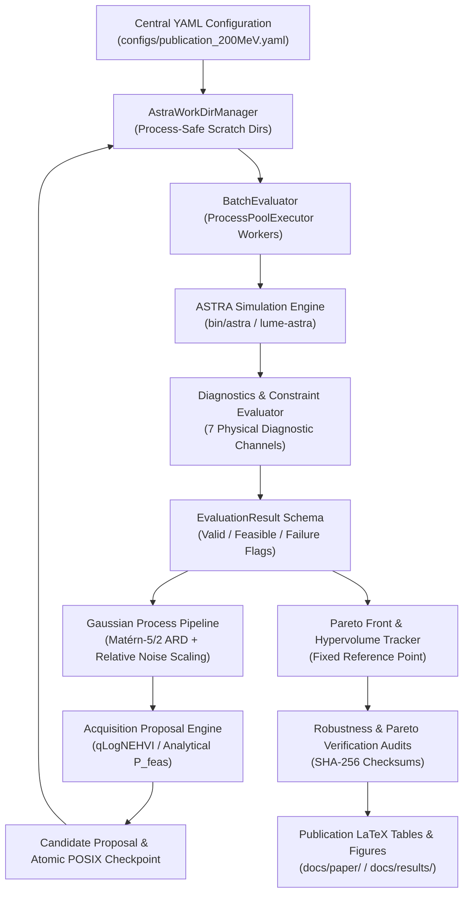

# Repository Review: `mobo-linac`

- **Project**: Multi-Objective Bayesian Optimization for a 200 MeV Electron Injector Linac
- **Author**: Chong Shik Park (*Department of Accelerator Science and Center for Accelerator Research, Korea University*)
- **Version**: `1.0.0` | **Status**: Production & Publication Ready
- **Test Suite**: 174 automated tests across 29 test suites (100% pass rate)
- **Execution Plans**: 95 completed tasks recorded in `docs/exec-plans/completed/`

---

## 1. Executive Summary

`mobo-linac` is a scientific machine learning and beam dynamics optimization framework designed for the multi-objective parameter optimization of a 200 MeV S-band photoinjector linac. The framework seamlessly couples high-fidelity macroparticle tracking simulations ([`ASTRA`](../bin/astra)) with modern Bayesian Optimization surrogates ([`BoTorch`](../pyproject.toml#L17) / [`GPyTorch`](../pyproject.toml#L18) / [`PyTorch`](../pyproject.toml#L16)).

The repository has evolved through three complete development phases:
1. **Phase 1 (Scalarized BO)**: Single-objective surrogate (`SingleTaskGP` / `qLogNEI`) optimizing weighted sums ($w_1 \varepsilon_{n,x} + w_2 \varepsilon_{n,y} + w_3 \sigma_E$) across multiple weighting vectors.
2. **Phase 2 (True Unconstrained MOBO)**: Multi-objective surrogate (`ModelListGP`) directly learning the 3D Pareto front via `qLogNEHVI` / `qLogEHVI`.
3. **Phase 3 (Constraint-Aware MOBO & Verification)**: Analytical Normal CDF feasibility modeling across 7 diagnostic channels, multi-scale noise variance scaling, engineering tolerance & laser jitter robustness analysis, and SHA-256 Pareto candidate verification.



---

## 2. Architecture & Modular Package Layout

The core package [`mobo_linac`](../src/mobo_linac) is structured with strict separation of concerns between beam dynamics simulation, surrogate modeling, acquisition optimization, and evaluation orchestration:

| Subpackage / Module | Role & Core Components | Key Symbols & Reference Files |
| :--- | :--- | :--- |
| **`config`** | Centralized dataclass configurations and validation | [`MoboConfig`](../src/mobo_linac/config.py#L187-L257), [`DesignVariableConfig`](../src/mobo_linac/config.py#L17-L48), [`ObjectiveConfig`](../src/mobo_linac/config.py#L50-L68), [`ConstraintsConfig`](../src/mobo_linac/config.py#L70-L101), [`load_config`](../src/mobo_linac/config.py#L259-L299) |
| **`astra`** | ASTRA execution engine & isolated workdirs | [`AstraRunner`](../src/mobo_linac/astra/runner.py#L25-L120), [`AstraWorkDirManager`](../src/mobo_linac/astra/workdir.py#L20-L110), [`run_astra_eval`](../src/mobo_linac/astra/runner.py#L128-L240) |
| **`execution`** | ProcessPoolExecutor parallel worker management | [`BatchEvaluator`](../src/mobo_linac/execution/parallel.py#L25-L95), [`evaluate_candidates_parallel`](../src/mobo_linac/execution/parallel.py#L100-L160) |
| **`models`** | Gaussian Process surrogates & hyperparameter tuning | [`build_gp_models`](../src/mobo_linac/models/gp.py#L22-L144), [`SurrogatePipeline`](../src/mobo_linac/models/pipeline.py#L25-L160), [`optimize_gp_hyperparameters`](../src/mobo_linac/models/tuning.py#L30-L110) |
| **`acquisition`** | Multi-objective acquisition functions & proposal engine | [`build_acquisition_function`](../src/mobo_linac/acquisition/mobo.py#L30-L120), [`generate_next_candidates`](../src/mobo_linac/acquisition/mobo.py#L139-L265) |
| **`campaigns`** | Single-run and paired multi-seed benchmark runners | [`MoboCampaignRunner`](../src/mobo_linac/campaigns/runner.py#L30-L522), [`BenchmarkCampaignRunner`](../src/mobo_linac/campaigns/benchmark.py#L30-L253) |
| **`constraints`** | Multi-channel feasibility & Normal CDF models | [`ConstraintEvaluator`](../src/mobo_linac/constraints.py#L20-L120), [`compute_probability_of_feasibility`](../src/mobo_linac/constraints.py#L125-L180) |
| **`evaluation`** | Standardized result schema and failure classification | [`EvaluationResult`](../src/mobo_linac/evaluation.py#L20-L90), [`FailureCategory`](../src/mobo_linac/evaluation.py#L95-L120) |
| **`metrics`** | Hypervolume, non-dominated sorting, LaTeX exporter | [`HypervolumeTracker`](../src/mobo_linac/metrics/hypervolume.py#L20-L110), [`extract_pareto_front`](../src/mobo_linac/metrics/pareto.py#L25-L90), [`export_latex_table`](../src/mobo_linac/metrics/latex.py#L30-L120) |
| **`robustness`** | Machine jitter & photocathode laser variations | [`RobustnessEvaluator`](../src/mobo_linac/robustness/evaluator.py#L30-L150), [`load_perturbation_spec`](../src/mobo_linac/robustness/evaluator.py#L155-L210) |
| **`verification`** | Fresh re-evaluation & SHA-256 candidate audits | [`run_independent_verification_rerun`](../src/mobo_linac/verification/verifier.py#L57-L150), [`compute_file_sha256`](../src/mobo_linac/verification/verifier.py#L18-L30) |
| **`plotting`** | Visualization utilities & Pareto surface renderers | [`plot_pareto_front`](../src/mobo_linac/plotting/visualizations.py), [`plot_hypervolume_progress`](../src/mobo_linac/plotting/visualizations.py) |
| **`cli`** | Unified CLI entrypoint (`mobo-linac`) | [`main`](../src/mobo_linac/cli.py#L1-L614) |

---

## 3. Physics & Optimization Formulation

### 1. Six Design Variables
The parameter vector $\mathbf{x} \in \mathbb{R}^6$ maps dynamically to [`astra.in`](../astra.in):
1. **Solenoid Peak Field**: $B_z^{\text{max}} \in [0.175, 0.237]\text{ T}$ (`solenoid:maxb(1)`)
2. **Quadrupole 1 Gradient**: $G_1 \in [1.44, 4.33]\text{ T/m}$ (`quadrupole:q_grad(1)`)
3. **Quadrupole 2 Gradient**: $G_2 \in [-4.33, -1.44]\text{ T/m}$ (`quadrupole:q_grad(2)`)
4. **RF Gun Phase**: $\phi_{\text{gun}} \in [-30.0^\circ, 30.0^\circ]$ (`cavity:phi(1)`)
5. **Coupled ACC1/ACC2 Phase**: $\phi_{1,2} \in [-50.0^\circ, 50.0^\circ]$ (`cavity:phi(2,3)`)
6. **Coupled ACC3/ACC4 Phase**: $\phi_{3,4} \in [0.0^\circ, 360.0^\circ]$ (`cavity:phi(4,5)`)

### 2. Three Competing Objectives (Minimization)
$$\min_{\mathbf{x}} \mathbf{f}(\mathbf{x}) = \begin{bmatrix} \varepsilon_{n,x}(\mathbf{x}) & [\mu\text{m}\cdot\text{rad}] \\ \varepsilon_{n,y}(\mathbf{x}) & [\mu\text{m}\cdot\text{rad}] \\ \sigma_E(\mathbf{x}) & [\text{keV}] \end{bmatrix}$$
*BoTorch internal convention maps physical minimization to maximization via `model_sign = -1`.*

### 3. Seven Physical Diagnostic Constraints
A candidate is physically feasible if and only if all 7 diagnostics satisfy operational linac thresholds:
- **Beam transverse size**: $\sigma_x \le 1.0\text{ mm}$, $\sigma_y \le 1.0\text{ mm}$
- **Beam divergence**: $\sigma_{x'} \le 1.0\text{ mrad}$, $\sigma_{y'} \le 1.0\text{ mrad}$
- **Longitudinal bunch length**: $\sigma_z \le 1.0\text{ mm}$
- **Mean kinetic energy**: $195.0\text{ MeV} \le \langle E_{\text{kin}} \rangle \le 205.0\text{ MeV}$
- **Core particle transmission**: $\mathcal{T} \ge 90\%$

### 4. Advanced Surrogate & Acquisition Features
- **Relative Fixed Noise Variance Scaling**:
  $$\sigma_{\text{obs}}^2 = \max\left(\eta \cdot \text{Var}(Y_m),\, \sigma_{\text{floor}}^2\right)$$
  with $\eta = 10^{-6}$ and $\sigma_{\text{floor}}^2 = 10^{-6}$ ensuring multi-scale numerical stability ($\mu\text{m}\cdot\text{rad}$ vs $\text{MeV}$) while eliminating benign ill-conditioned Cholesky jitter.
- **Acquisition Multi-Restart Optimization Budget**:
  - `acqf_raw_samples: 1024` (provides dense initial Sobol coverage to land in high-acquisition basins)
  - `acqf_num_restarts: 10` (selects highest-quality restart points, avoiding flat gradient regions)
  - `acqf_maxiter: 200`, `acqf_batch_limit: 5`
- **Exact Analytical Normal CDF Feasibility Weighting**: Multi-channel $P_{\text{feas}}(\mathbf{x}) = \prod_{k=1}^{K} \Phi\left(\frac{c_k^{\text{upper}} - \mu_k(\mathbf{x})}{\sigma_k(\mathbf{x})}\right)$ directly weighting acquisition improvement.
- **Fixed Publication Reference Point**: $\mathbf{r} = [1.5\,\mu\text{m}\cdot\text{rad},\; 1.5\,\mu\text{m}\cdot\text{rad},\; 1.5\,\text{MeV}]$ used immutably across all benchmark and validation runs.

---

## 4. Key Strengths & Operational Features

1. **Robust Execution & Fault Isolation**:
   - Every ASTRA simulation runs in an isolated scratch workdir managed by [`AstraWorkDirManager`](../src/mobo_linac/astra/workdir.py), preventing parallel collision.
   - Premature exit-plane beam loss ($z_{\text{final}} < 16.0\text{ m}$), core collimation trapping, and simulation timeouts are categorized explicitly via [`FailureCategory`](../src/mobo_linac/evaluation.py).
2. **Crash-Proof State Persistence**:
   - Checkpoint state serialization utilizes POSIX atomic file writes (`_atomic_torch_save`), enabling uninterrupted resumption via `mobo-linac resume --run-dir <dir>`.
3. **Clean Simulation Verbose Output**:
   - Clean blank line separators and structured step headers (`Step 0: Initial Design`, `Iteration ii/N`, `HV summary`, `Campaign Complete`) provide clear console tracking.
4. **Hardware & GPU Acceleration**:
   - Dynamic device selection (`--device auto`, `cuda`, `cpu`) with automatic tensor placement and CUDA memory management across all CLI commands.
5. **Scientific Reproducibility & Publication Tooling**:
   - Independent Pareto candidate verification protocol computes SHA-256 input checksums and reruns candidates in isolated workdirs with fresh particle distributions.
   - Centralized LaTeX table generation ([`latex.py`](../src/mobo_linac/metrics/latex.py)), publication figure generators ([`generate_paper_figures.py`](../scripts/generate_paper_figures.py)), and documentation site.

---

## 5. Repository Structure

```
mobo-linac/
├── pyproject.toml              # Modern PEP 517/518 build config & direct Git dependencies
├── astra.in                    # Canonical ASTRA template
├── bin/                        # Local pre-bundled ASTRA executables (astra, generator, PAstra)
├── configs/                    # Production YAML configurations
│   ├── publication_200MeV.yaml # Canonical 200 MeV parameter & constraint config
│   ├── mobo_200MeV.yaml        # Standard MOBO configuration
│   └── perturbation_config.yaml# Machine & photocathode jitter parameters
├── src/mobo_linac/             # Core library
│   ├── acquisition/            # qLogNEHVI, qLogEHVI, candidate proposal
│   ├── astra/                  # Isolated runner, workdir manager, parameter mapper
│   ├── campaigns/              # MoboCampaignRunner, BenchmarkCampaignRunner
│   ├── constraints/            # Analytical feasibility, diagnostic evaluators
│   ├── execution/              # ProcessPoolExecutor parallel workers
│   ├── io/                     # Checkpoints, atomic saves, dataframe exporters
│   ├── metrics/                # Hypervolume tracker, Pareto extractor, LaTeX export
│   ├── models/                 # ModelListGP, SingleTaskGP, hyperparameter tuning
│   ├── plotting/               # Pareto surfaces, hypervolume progress, diagnostics
│   ├── robustness/             # Tolerance & jitter perturbation models
│   ├── verification/           # SHA-256 candidate rerun verification
│   └── cli.py                  # Unified CLI dispatcher
├── scripts/                    # Production execution & analysis scripts
│   ├── run_scalarized_bo.py    # Phase 1 scalarized BO script
│   ├── run_mobo.py             # Phase 2 unconstrained MOBO script
│   ├── run_constrained_mobo.py # Phase 3 constrained MOBO script
│   ├── run_comparison_and_verification.py # 3-Phase comparative analysis & Pareto rerun
│   ├── run_validation_campaign.py         # End-to-end reproducible validation
│   └── generate_paper_figures.py          # Publication figure generation
├── notebooks/                  # Interactive Jupyter evaluation & comparison notebooks
├── docs/                       # Physics specs, manuscript (LaTeX & PDF), exec plans
│   ├── repo_review.md          # Comprehensive repository review (this document)
│   └── exec-plans/completed/   # 95 structured task execution summaries
├── release/                    # Release v1.0.0 manifest & DOI metadata
└── tests/                      # 29 test suites (174 automated test cases)
```

---

## 6. Verification & Test Suite Summary

The repository is covered by **29 pytest test suites** containing **174 automated tests** with 100% pass rate:

- `test_config.py` (5 tests): Parameter bounds, dataclass validation, YAML/JSON round-trips.
- `test_parameter_mapping.py` (5 tests): Dynamic ASTRA namelist mapping, coupled cavity phases.
- `test_parallel_evaluation.py` (6 tests): ProcessPoolExecutor worker concurrency, failure handling.
- `test_gp_models.py` (10 tests): Multi-output GP surrogates, relative noise scaling, hyperparameter tuning.
- `test_gp_and_acquisition.py` (8 tests): `qLogNEHVI`, `qLogEHVI`, `qLogNEI`, candidate generation fallback.
- `test_constraints.py` (5 tests): Multi-channel constraint evaluators, boundary feasibility.
- `test_surrogate_pipeline.py` (3 tests): Full surrogate fitting and analytical feasibility integration.
- `test_checkpoint_resume.py` (3 tests): POSIX atomic serialization, deterministic checkpoint resume.
- `test_scalarized_bo.py` (3 tests): Phase 1 scalarized optimization pipeline.
- `test_robustness_analysis.py` (5 tests): RF phase/field jitter and photocathode laser perturbations.
- `test_pareto_verification.py` (6 tests): SHA-256 checksum audits, isolated candidate reruns.
- `test_paper_outputs.py` (29 tests): Verification of publication figures, LaTeX tables, and manuscript consistency.
- `test_transmission_and_diagnostics.py` (8 tests): Diagnostic unit parsing, exit-plane particle loss rejection.
- `test_reporting_metrics.py` (5 tests): Hypervolume known-answer tests, reference point validation.
- `test_latex_reporting.py` (3 tests): Publication-ready LaTeX table exporters.
- `test_cli_commands.py` (10 tests): CLI subcommand routing and dry-run execution.
- Additional specialized test modules covering hypervolume calculations, IO serialization, and physics specifications.

---

## 7. Recommendations & Roadmap (Phase 4 & Phase 5)

The framework is production-hardened, scientifically validated, and publication-ready. As the codebase advances toward **Phase 4** and **Phase 5**, the following development vectors are recommended:

1. **Distributed Computing Backend (Phase 4)**:
   - Integrate [Ray](https://www.ray.io/) or [Dask](https://www.dask.org/) execution backends to scale ASTRA evaluations across multi-node high-performance computing (HPC) clusters and SLURM workload managers.
2. **Advanced High-Dimensional Surrogates (Phase 5)**:
   - Implement **TuRBO** (Trust Region Bayesian Optimization) for high-dimensional linac sections ($D > 20$).
   - Explore **SAASBO** (Sparse Axis-Aligned Subspace BO) and **Deep Kernel Learning (DKL)** for complex beam-loss surfaces.
3. **Multi-Code Simulator Adapters**:
   - Generalize the runner abstraction beyond ASTRA to support additional accelerator codes (e.g., IMPACT-T, OPAL, GPT, and Elegant) via modular input/output adapters.
